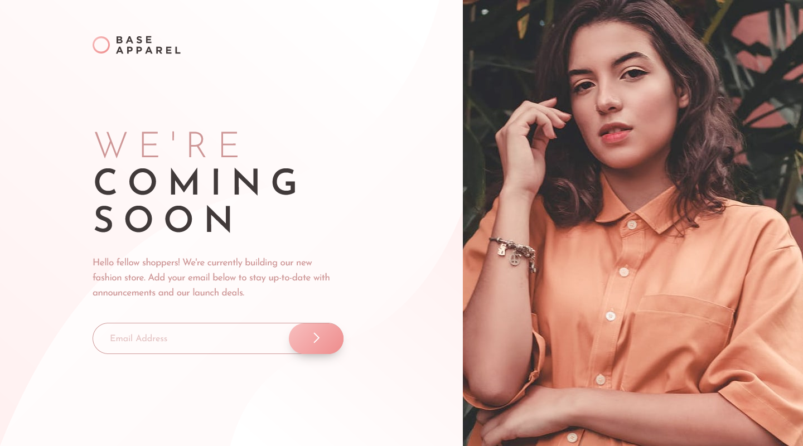

# Frontend Mentor - Base Apparel coming soon page solution

This is a solution to the [Base Apparel coming soon page challenge on Frontend Mentor](https://www.frontendmentor.io/challenges/base-apparel-coming-soon-page-5d46b47f8db8a7063f9331a0). Frontend Mentor challenges help you improve your coding skills by building realistic projects. 

## Table of contents

- [Overview](#overview)
  - [The challenge](#the-challenge)
  - [Screenshot](#screenshot)
  - [Links](#links)
- [My process](#my-process)
  - [Built with](#built-with)
  - [What I learned](#what-i-learned)
  - [Continued development](#continued-development)
  - [Useful resources](#useful-resources)
- [Author](#author)
- [Acknowledgments](#acknowledgments)


## Overview

### The challenge

Users should be able to:

- View the optimal layout for the site depending on their device's screen size
- See hover states for all interactive elements on the page
- Receive an error message when the `form` is submitted if:
  - The `input` field is empty
  - The email address is not formatted correctly

### Screenshot




### Links

- Solution URL: [Add solution URL here](https://your-solution-url.com)
- Live Site URL: [Live Site URL](https://jaycgreenwald.github.io/15-base-apparel-coming-soon-page/)

## My process


### Built with

- Semantic HTML5 markup
- CSS custom properties
- Flexbox
- CSS Grid
- Mobile-first workflow
- SASS/SCSS


### What I learned

- New Things I Tried
  + Added a js event so user can also press enter in addition to clicking the button to submit data.
  + Adding a transition for opacity. I wanted to use a lighter color on the button, but when I transitioned from a gradient to a single color I got some wierd results. I was reading Josh W. Comeau's article on transitions when the lightbulb turned on; use opacity to make the button lighter.
  + I used minmax with grid for the first time. I used it to make the space between the left and right halves grow or shrink as needed. I like the way it turned out.


```css
.page {
  display: grid;
  grid-template-columns: 1fr 31.6875rem minmax(0px, 190px) 38.125rem; 
  grid-template-rows: auto 1fr;
  grid-template-areas: 
  ". logo    . hero"
  ". content . hero";
  height: 100vh;
}
```
```js
submitButton.addEventListener("keypress", function(event) {
  if (event.key === "Enter") {
    event.preventDefault();
    submitButton.click();
  }
});
```


### Questions

1. At what point is increased precision no longer beneficial? I recently chose a line height of 1.07. Is that too granular of a value? Would it be better to use 1 or 1.1? (For the record, I have read Josh W. Comeau's article about pixel perfection.)
2. Is it okay to use percentage for padding like I did to make my hero image to appear? (It's in the _mobile partial.)
3. Did I achieve some responsiveness? I could make it look good at 1440x800, but at wider sizes not so much (in my opinion). But adding an extra media query keeps the page centered starting at the 1441px mark. I think this looks better at those wider dimensions. 


### Continued development

I want to continue to learn about flexible grids.


### Useful resources

- [8 Tips to Help You Get the Best out of Sass](https://www.sitepoint.com/8-tips-help-get-best-sass/) - This was a nice overview.
- [3 Useful CSS Hacks](https://www.youtube.com/watch?v=MywezIxlp8Y) - I stumbled into the first tip about rounding buttons right when I was pondering that very issue.
- [How TO - Trigger Button Click on Enter](https://www.w3schools.com/howto/howto_js_trigger_button_enter.asp) - Exactly what I was looking for.
- [An Interactive Guide to CSS Transitions](https://www.joshwcomeau.com/animation/css-transitions/) - A comprehensive article that I will return to over and over.

## Author

- Website - [jaycgreenwald at GitHub](https://github.com/jaycgreenwald)
- Frontend Mentor - [@jaycgreenwald](https://www.frontendmentor.io/profile/jaycgreenwald)
- Twitter - [@jaycgreenwald](https://www.twitter.com/jaycgreenwald)

